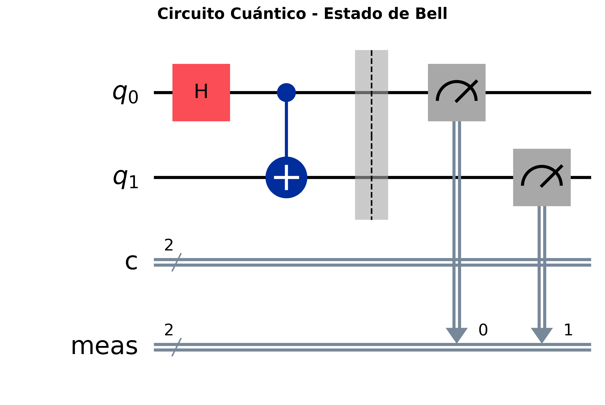

# Quantum Computing Experiments with Qiskit

Este repositorio contiene experimentos básicos de computación cuántica implementados con Qiskit, diseñados para demostrar conceptos fundamentales de la mecánica cuántica y la computación cuántica.

## Contenido del Proyecto

### Notebooks Incluidos

1. **Bell State (`bell_state.ipynb`)** - Demostración de entrelazamiento cuántico
   - Creación de un estado de Bell entre dos qubits
   - Explicación teórica del entrelazamiento
   - Simulación y visualización de resultados

2. **Quantum Random Number Generator (`qrng.ipynb`)** - Generador de números aleatorios cuánticos
   - Implementación usando puertas Hadamard
   - Análisis estadístico de la aleatoriedad cuántica
   - Comparación con generadores clásicos

### Conceptos Cuánticos Demostrados

- **Superposición**: Estados que son combinaciones lineales de estados base
- **Entrelazamiento**: Correlaciones cuánticas entre qubits
- **Medición**: Colapso del estado cuántico a estados clásicos
- **Puertas Cuánticas**: Hadamard, CNOT y otras operaciones fundamentales

## Instalación y Configuración

### Prerrequisitos

- Python 3.8 o superior
- pip (gestor de paquetes de Python)

### Configuración del Entorno

1. **Clonar el repositorio**
   ```bash
   git clone https://github.com/tu-usuario/quantum-computing-experiments.git
   cd quantum-computing-experiments
   ```

2. **Crear un entorno virtual**
   ```bash
   python -m venv venv
   ```

3. **Activar el entorno virtual**
   
   En Windows:
   ```bash
   venv\Scripts\activate
   ```
   
   En macOS/Linux:
   ```bash
   source venv/bin/activate
   ```

4. **Instalar las dependencias**
   ```bash
   pip install -r requirements.txt
   ```

5. **Iniciar Jupyter Notebook**
   ```bash
   jupyter notebook
   ```

6. **Navegar a la carpeta `notebooks/` y abrir los archivos `.ipynb`**

## Resultados y Visualizaciones

Los notebooks generan automáticamente:

- **Diagramas de circuitos cuánticos**: Representación visual de las operaciones
- **Histogramas de resultados**: Distribuciones de probabilidad de mediciones
- **Análisis estadísticos**: Verificación de propiedades cuánticas

Las imágenes se guardan automáticamente en la carpeta `images/` para referencia.

### Ejemplos de Resultados


*Circuito cuántico para generar un estado de Bell*


*Distribución de números aleatorios cuánticos*

## Conceptos Teóricos

### Puertas Cuánticas Utilizadas

#### Puerta Hadamard (H)
- **Función**: Crea superposición, llevando |0⟩ → (|0⟩ + |1⟩)/√2
- **Matriz**: 1/√2 * [[1, 1], [1, -1]]
- **Uso**: Base para generar estados superpuestos

#### Puerta CNOT (CX)
- **Función**: Puerta controlada que invierte el qubit objetivo si el control está en |1⟩
- **Efecto**: Crea entrelazamiento entre qubits
- **Uso**: Fundamental para la creación de estados de Bell

### Estados de Bell
Los estados de Bell son los cuatro estados cuánticos maximamente entrelazados de dos qubits:
- |Φ⁺⟩ = (|00⟩ + |11⟩)/√2
- |Φ⁻⟩ = (|00⟩ - |11⟩)/√2  
- |Ψ⁺⟩ = (|01⟩ + |10⟩)/√2
- |Ψ⁻⟩ = (|01⟩ - |10⟩)/√2

## Tecnologías Utilizadas

- **Qiskit**: Framework de computación cuántica de IBM
- **Matplotlib**: Visualización de datos y gráficos
- **Jupyter Notebook**: Entorno interactivo de desarrollo
- **NumPy**: Computación numérica
- **Qiskit Aer**: Simulador cuántico local

## Recursos Adicionales

- [Documentación oficial de Qiskit](https://qiskit.org/documentation/)
- [Qiskit Textbook](https://qiskit.org/textbook/)
- [IBM Quantum Experience](https://quantum-computing.ibm.com/)

## Contribuciones

Las contribuciones son bienvenidas. Por favor:

1. Fork el proyecto
2. Crea una rama para tu feature (`git checkout -b feature/AmazingFeature`)
3. Commit tus cambios (`git commit -m 'Add some AmazingFeature'`)
4. Push a la rama (`git push origin feature/AmazingFeature`)
5. Abre un Pull Request


